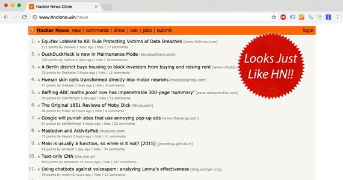

## Hacker News Clone  [](https://github.com/clintonwoo/hackernews-react-graphql/stargazers) [](https://github.com/clintonwoo/hackernews-react-graphql/) [](https://github.com/clintonwoo/hackernews-react-graphql/issues) [](https://github.com/clintonwoo/hackernews-react-graphql/pulls)

This project is a clone of hacker news rewritten with universal Javascript, using React and GraphQL. It is intended to be an example or boilerplate to help you structure your projects using production-ready technologies.
<p align="center" margin-bottom="0">
  <a href="http://www.hnclone.win" target="_blank">
    
  </a>
</p>
<p align="center">
  <a href="http://www.hnclone.win">Live Demo</a>
</p>


## Featuring
- React - (UI Framework)
- GraphQL - (Web Data API)
- Apollo - (GraphQL Client)
- Next - (Routing, SSR, Hot Module Reloading, Code Splitting, Build tool uses Webpack)
- Redux - (State Management)
- Node.js - (Web Server)
- Express - (Web App Server)
- Passport - (Authentication)
- Babel - (JS Transpiling)
- Flow - (Static Types)
- ESLint - (JS Best Practices/Code Highlighting)
- Jest - (Tests)
- Yarn Package Manager - (Better Dependencies)
- Docker - (Container Deployment)

## Benefits
**Front End**
- Declarative UI - (react)
- Flux State Management - (redux)
- GraphQL Query Colocation - (react-apollo)

**Server**
- Universal JS - (node & express)
- Declarative GraphQL Schema - (react-tools)
- GraphQL Query Batching - (apollo-server-express)
- GraphQL Stored Queries - (apollo-server-express)
- Easy GraphiQL Include - (apollo-server-express)
- Local Authentication Strategy - (passport)
- Server Side Rendering - (next)
- Code Splitting - (next)
- Build to Static Website - (next)
- Container Based Runtime - (docker)

**Dev/Test**
- Hot Module Reloading - (next)
- Snapshot Testing - (jest)
- Faster Package Install - (yarn)

## One Click Download

You can download and run the repo with one command to rule them all:

`git clone https://github.com/clintonwoo/hackernews-react-graphql.git && cd hackernews-react-graphql && npm install && npm run dev`

## How To Start

Running the app in dev mode is fully featured including *hot module reloading*:

`npm install`

`npm run dev`

To run in production mode:

`npm run build && npm start`

## Configuration

The project runs out of the box with default settings (*/src/config.js*). You can include a .env file in your project root to configure settings (this is the '*dotenv*' npm package). The *.env* file is included in *.gitignore*.

## How To Test

`npm test`

This project uses Jest and can do snapshot testing of React components. Whenever a component is changed, please update the snapshots using `npm test -- -u` or `jest --updateSnapshot`.

## How To Build For Deployment

`npm run build`: NextJS app with entry point */src/server.js* that uses Node.js/Express.

OR

`npm run build-docker` `npm run build-docker`
Docker Container: Builds a docker container using Dockerfile.


**Static Website (Optional)**

NextJS lets us make a powerful static website but server rendering dynamic routes can be difficult.

`npm run build-static-website`: Builds static website to */build/static*. Use a static web server *eg.* NGINX/Github Pages.

## Debugging

```js
const NewsFeed = props => {
  debugger;
  return (
    <NewsItem {...props} />
  )
}
```

```npm run debug-mode ```

Debug mode (it's built into node.js) with *debugger* breakpoints like above can pause execution of code for your troubleshooting convenience.

You can open the inspector link in Google Chrome to see the call stack, scope and variables etc. Google search to [learn more](https://medium.com/@paul_irish/debugging-node-js-nightlies-with-chrome-devtools-7c4a1b95ae27).

## Contributing
Pull requests are welcome. File an issue for ideas, conversation or feedback.

## License
Apache 2.0 License. Copyright © 2017, Clinton D'Annolfo. All rights reserved.

## Community
After you ★Star this project, follow [@ClintonDAnnolfo](https://twitter.com/clintondannolfo) on Twitter.
