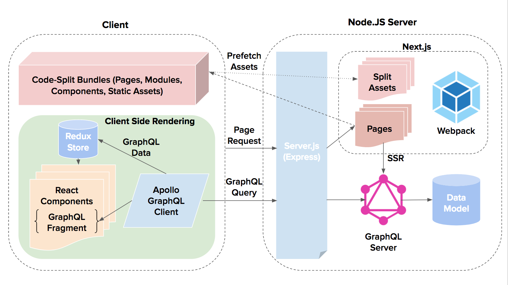

<h2 align="center">Hacker News Clone React/GraphQL</h2>

 
 
 

This project is a clone of hacker news rewritten with universal JavaScript, using React and GraphQL. It is intended to be an example or boilerplate to help you structure your projects using production-ready technologies.

  

  <a href="http://www.hnclone.win">Live Demo</a>

## Overview

### Featuring

- React - (UI Framework)
- GraphQL - (Web Data API)
- Apollo - (GraphQL Client/Server)
- Next - (Routing, SSR, Hot Module Reloading, Code Splitting, Build tool uses Webpack)
- TypeScript - (Static Types)
- Webpack - (Module Bundler)
- PostCSS - (CSS Processing)
- Node.js - (Web Server)
- Express - (Web App Server)
- Passport - (Authentication)
- ESLint - (Coding Best Practices/Code Highlighting)
- Jest - (Tests)
- Docker - (Container Deployment)

- Optional - Yarn or Pnpm Package Manager - (Better Dependencies)

### Benefits

**Front End**

- Declarative UI - (`react`)
- Static Typing (`typescript`)
- GraphQL Fragment Colocation - (`react-apollo`)
- Prefetch Page Assets - (`next`)

**Server**

- Universal JS - (`node` & `express`)
- Declarative GraphQL Schema - (`apollo-server`)
- GraphQL Query Batching - (`apollo-server-express`)
- GraphQL Stored Queries - (`apollo-server-express`)
- Easy GraphiQL Include - (`apollo-server-express`)
- Local Authentication Strategy - (`passport`)
- Server Side Rendering - (`next`)
- Code Splitting - (`next`)
- Build to Static Website - (`next`)
- Container Based Runtime - (`docker`)

**Dev/Test**

- Hot Module Reloading - (`next`)
- Snapshot Testing - (`jest`)
- GraphQL Playground - (`apollo-server-express`)
- Faster Package Install - (`pnpm`/`yarn`)
- JS/TS Best Practices - (`eslint`)

### Architecture Overview

  

`server.ts` is the entry point. It uses Express and passes requests to Next. Next SSR renders the pages using `getServerSideProps()` hook from Apollo helper. Therefore the app makes GraphQL requests on the client or server.

When the client loads the page it preloads next pages code from any `<Link href="/">`. When the client navigates to the next page it only needs to make one GraphQL query to render. _Great!_

See more: <a href="https://github.com/zeit/next.js/">Next.js</a>,
<a href="http://dev.apollodata.com/react/">Apollo GraphQL Client</a>

GraphQL: <a href="http://dev.apollodata.com/tools/graphql-tools/index.html">GraphQL-Tools by Apollo</a>
or
<a href="http://graphql.org/graphql-js/">GraphQL docs</a>

### Directory Structure

Each web page has a React component in `pages`. Server code is in `server`. Shared code that runs on client or server is in `src`. Do not import from `server` or `pages` in `src` to avoid running code in the wrong environment.

The project root contains config files such as TypeScript, Babel, ESLint, Docker, Flow, NPM, Yarn, Git.

## How To Start

### One Click Download & Run

You can download and run the repo with one command to rule them all:

`git clone https://github.com/clintonwoo/hackernews-react-graphql.git && cd hackernews-react-graphql && npm install && npm start`

### Setup

Running the app in dev mode is fully featured including _hot module reloading_:

`npm install`

`npm start`

To run in production mode:

`npm run build:prod && npm run start:prod`

### Configuration

The project runs out of the box with default settings (`/src/config.ts`). You can include a .env file in your project root to configure settings (this is the '_dotenv_' npm package). The _.env_ file is included in _.gitignore_.

## How To Test

### Jest

`npm test`

This project uses Jest and can do snapshot testing of React components. Whenever a component is changed, please update the snapshots using `npm test -- -u` or `npx jest --updateSnapshot`.

## How To Build For Deployment

`npm run build:prod`: NextJS app with entry point `server.ts` that uses Node.js/Express. Uses TypeScript compiler to transpile project src to build.

OR

`npm run build-docker`
Docker Container: Builds a docker container using Dockerfile.

#### Static Website (Optional)

NextJS lets us make a powerful static website but you need to consider if you need server side rendering.

`npm run build-static-website`: Builds static website to `/build/static`. Use a static web server _eg._ NGINX/Github Pages.

## Contributing

Pull requests are welcome. File an issue for ideas, conversation or feedback.

### Community

After you ★Star this project, follow [@ClintonDAnnolfo](https://twitter.com/clintondannolfo) on Twitter.
